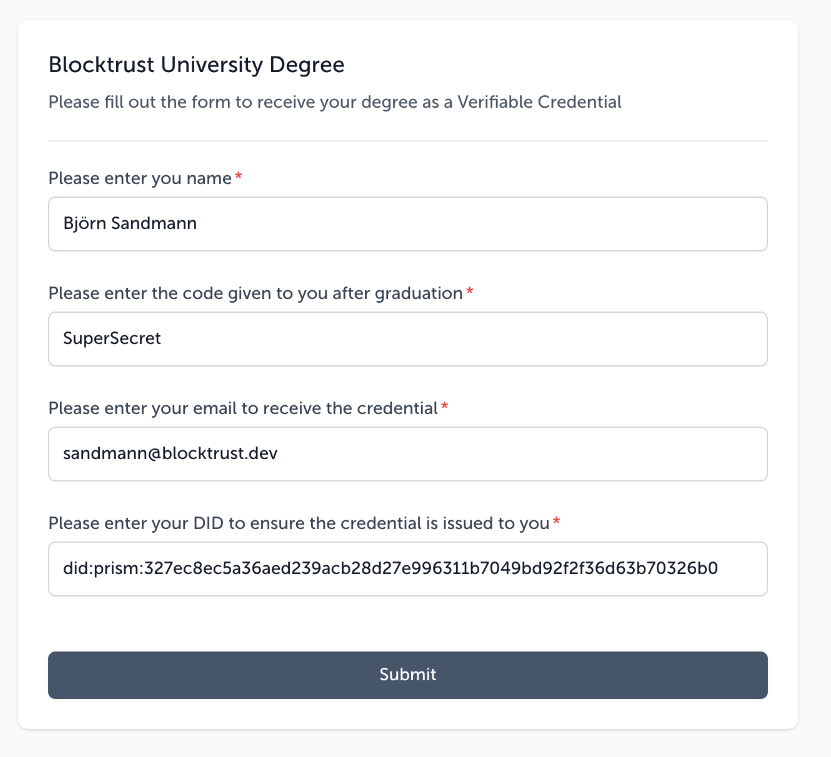

# Issuing W3C Credentials after filling out a Form
The guide we assume that a Credential should be issued to someone after filling out a form. The form should include a name and email Address as well as secret-key which we assume must be validated.

## Prerequisites
### Setting up an Issuing DID
Before you can issue credentials, you need to set up an DID which is **published** on chain which does contain an **Issuing key**. A issuing key is a key pair which is used to sign the credentials. In the **DID-Document** an issuing key can be identified by the `assertionMethod` property.
The [Create and Update DID](../UserGuides/CreatingAndUpdatingDids.md) guide goes over the process of creating a DID and adding an issuing key to it. From a pure technical perspective an key inside the assertion-Method property it not different from a key inside the authentication property. The only difference is that the key inside the assertionMethod property is used to sign credentials by definition. For more details on how the DID is setup have a look at the [DID specification](https://www.w3.org/TR/did-1.0/) and also at the [PRISM DID specification](https://github.com/input-output-hk/prism-did-method-spec/blob/main/w3c-spec/PRISM-method.md). In prior version of [Identus](https://hyperledger-identus.github.io/docs/) the issuing-key was also named e.g. `issuingKey-1` to better identify it. 

If you already followed the [Create and Update DID](../UserGuides/CreatingAndUpdatingDids.md) guide you can skip this step, as the DID is already created and the issuing key is linked in the tenant.
Otherwise:
 - Go to to the profile page and select the **Issuing Keys** tab. For more information on the Issuing Keys, please refer to the [Issuing Keys Settings documentation](../Settings/IssuingKeysSettings.md).
 - Enter the following values:
     - A name of your choice for the issuing key
     - The DID identitifer like `did:prism:6b7c5e9dd3c0d5bae65d21ea26fe452cf05ste36f1b7454aeb2b8e1ecd0c764eca`)
     - The KeyType which *must* be set to *secp256k1*
     - The PublicKey which is the x and y values from the previous step ("two part variant" / "uncompressed variant"). For example
         - `rS0gI6S32Vt_9wO_mhO820oAib86X5xKEiZyUanpxSw`
         - `gl-w_gJX4CbQmgW6BDoKXbdLVf5MQkwUStOk6n8TnG0`
     - The PrivateKey which is the d value from the previous step. In this example:
         - `02nnKLLcs9weejHteLuLryrVTQ6R1ffPU_9DP3qj5dU`
           This Issuing-Key-pair will later allow us to issuing a W3C Verifiable  Credential.    

**Note**: That the private key is stored in the system for this tenant. Do not use hosted version of the OPN instance for production purposes, as this may expose your private keys to unauthorized access.
For further details go to the [Issuing Keys Settings documentation](../Settings/IssuingKeysSettings.md).

## Workflow setup
### Create a new workflow 
- Go to the **Workflows** tab and click on the **Create New Workflow** button.
- In the top left rename and Workflow to your liking. For example `Issuing Credential`.

### Choose the Form-trigger
The form trigger is triggered if a used fills out form and clicks on the submit button. For more details on the form trigger, see the [Form Trigger documentation](../Triggers/FormTrigger.md).
1. Select the **Form Trigger** from the list of available triggers (under the **Manual triggers** tab).
2. Give the Form a title for the user to see e.g. "Blocktrust University Certification"
3. Add a description for the user to see e.g. "Please fill out the form to receive your degree as a Verifiable Credential"
4. Add **Name** as a field. Also enter a description like "Please enter your name"
5. Add **DID** as a field. Also enter a description like "Please enter your DID to ensure the credential is issued to you"
5. Add **Code** as a filed. Also enter a description like "Please enter the code given to you after graduation"
6. Add **Email** as a field. Also enter a description like "Please enter your email to receive the credential"

### Perform a Validation
Before creating and sending out the credential we want to validate the secret-key. We can do so by using the very flexible [Custom Validation Action](../Actions/CustomValidationAction.md). The Custom Validation Action allows you to perform a validation on the input of the form. In this case we want to check if the code is one of three valid codes.
1. Select the **Custom Validation Action** from the list of available actions (under the **Validation Actions** tab).
2. As the **Data Soruce** select the **From Trigger** and the **Code** field.
3. Add a new Validation Rule with the following values:
   - **Name**: Code must match
   - **Validation Expression**: `["ABC123", "SuperSecret", "DoNotShare"].includes(data.value)`. Since we are writing Javascript code we could for example achive the same result by this expression: ` data.value === "ABC123" || data.value === "SuperSecret" || data.value === "DoNotShare"`.
   - **Error Message**: "The code is not valid. Please contact the university."
4. Leave the Error Handling "Stop Workflow" selected. This means that if the validation fails, the workflow will stop and no credential will be issued.

### Create the Credential
Next we to create the credential. For this we will us the [Issue W3C Credential Action](../Actions/IssueW3CCredentialAction.md). The Issue W3C Credential Action allows you to create a W3C Verifiable Credential, and sign it with the Issuing key.
1. Select the **W3C VC Action** from the list of availab~~~~le actions (under the **Issue credentials** tab).
2. For the **Subject DID** field, select **From Trigger** and the **DID** field. This means that the credential will be issued to the DID entered in the form. You could have added an additional validation step to check if the DID is a valid format e.g. using regex in the prior step, but in case for the subject a Prism DID is not needed, it could even be some kind of other identifier (from a pure technical perspective).
3. For the **Isserier DID** select the Issue which we setup earlier in the Prerequisites section. 
4. For **Valid until** select the date when the credential should expire. For example 1 year from now.
5. Then click **Add Claims** to add a few claims:
    - For the first claim type `name` and select **From Trigger** and the **Name** field.
    - For the second claim type `degree` and select **Static** and type something like `Completion of the Blocktrust course`.

### Send Credential
Lastly we want to send the Credential to the email provided by the user. For this we will use the [Send Email Action](../Actions/EmailAction.md). The Send Email Action allows you to send an email to the user with the credential attached.
1. Select the **Email Action** from the list of available actions (under the **Communications** tab).
2. For the **To** field, select **From Trigger** and the **Email** field. This means that the email will be sent to the email entered in the form.
3. For the Subject field, enter a subject for the email. For example `Your Blocktrust University Credential`.
4. For the Body field, enter a message for the email. For example `Congratulations {{name}}! You have completed the Blocktrust course. Please find your credential here: {{credential}}`.
5. Since we used parameters in the body we need to sepcify the source of the parameters:
    - Add a new Parameter. The name is `name` and the source is **From Trigger** and the **Name** field.
    - Add a new Parameter. The name is `credential` and the source is **Action Outcome** and the **Issue W3C Credential**. This means that the credential will be attached to the email.
6. Click on **Save** to save the workflow.

## Testing the Workflow
The setup is now complete. After saving click on the **Run** button to enable the workflow. Next we need to go back to the **Form Trigger** and copy out the **Form Url**. Open the form in a browser.
This may look like this:


Shortly after submitting the form you should receive an email with the credential attached. The email may look like this:
```html
Congratulations Björn Sandmann! You have completed the Blocktrust course. Please find your credential here:

eyJhbGciOiJFUzI1NksiLCJ0eXAiOiJKV1QifQ.eyJpc3MiOiJkaWQ6cHJpc206NmI3YzVlOWRkM2MwZDViYWU2NWQyMWVhMjZmZTQ1MmNmMDVlMzZmMWI3NDU0YWViMmI4ZTFlY2QwYzc2NGVjYSIsInN1YiI6ImRpZDpwcmlzbTozMjdlYzhlYzVhMzZhZWQyMzlhY2IyOGQyN2U5OTYzMTFiNzA0OWJkOTJmMmYzNmQ2M2I3MDMyNmIwNDc0NWI1IiwidmMiOnsiQGNvbnRleHQiOlsiaHR0cHM6Ly93d3cudzMub3JnLzIwMTgvY3JlZGVudGlhbHMvdjEiXSwidHlwZSI6WyJWZXJpZmlhYmxlQ3JlZGVudGlhbCJdLCJpc3N1ZXIiOiJkaWQ6cHJpc206NmI3YzVlOWRkM2MwZDViYWU2NWQyMWVhMjZmZTQ1MmNmMDVlMzZmMWI3NDU0YWViMmI4ZTFlY2QwYzc2NGVjYSIsImV4cGlyYXRpb25EYXRlIjoiMjAyNi0wNS0xNlQyMzo1OTo1OS45OTk5OTk5IiwidmFsaWRGcm9tIjoiMjAyNS0wNS0xNlQxNzowNjowMi42ODk3OTU0IiwiY3JlZGVudGlhbFN1YmplY3QiOnsiaWQiOiJkaWQ6cHJpc206MzI3ZWM4ZWM1YTM2YWVkMjM5YWNiMjhkMjdlOTk2MzExYjcwNDliZDkyZjJmMzZkNjNiNzAzMjZiMDQ3NDViNSIsIm5hbWUiOiJCalx1MDBGNnJuIFNhbmRtYW5uIiwiZGVncmVlIjoiQ29tcGxldGlvbiBvZiB0aGUgQmxvY2t0cnVzdCBjb3Vyc2UifX0sIm5iZiI6MTc0NzQwNzk2MiwiZXhwIjoxNzc4OTY4Nzk5fQ.8JS9gtzw4dxa1j03yRgz4SWlmgSw9NFDWVy83YYFz8Hn-puUC29zdwT_R5DNLwWWhukNYdLTM-e9VJKD6kNLEA

```

This completes the second part of the guide. If you want to learn about credential verification, please continue to the [Verifying Credentials](../UserGuides/VerifyingCredentials.md) guide.


